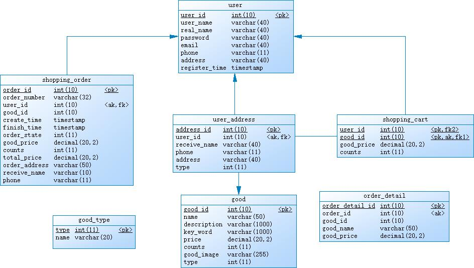

 网上商城数据库设计 

___  
   
  

数据库总体设计图 

   
## 一、表汇总  

  
``
| 序号 | 表名 | 功能说明 |
| :-: |  :-----: | :-: |
| 1 | user | 存储注册用户的信息 |
| 2 | user_address |存储用户的收货地址信息 |
| 3 | good | 存储商品的信息 |
| 4 | good_type | 存储商品的分类信息 |
| 5 | shopping_order | 存储用户的订单信息 |
| 6 | order_detail | 存储订单的商品信息 |

## 二、各个表的详细说明

  

| 字段名 | 字段类型 |  | 
| :-: | :-: | :-: | 
| Name | Academy | score | 
| d | ss |
| Harry Potter | Gryffindor| 90 | 
| Hermione Granger | Gryffindor | 100 | 
| Draco Malfoy | Slytherin | 90 |

