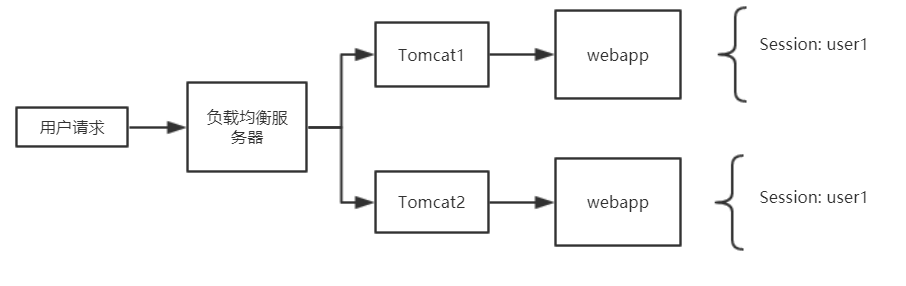

 

 网上商城设计文档 

## **需求概述**
___
网上商城是一个简化的电子商务系统，它包括完整的网上销售功能；普通用户的浏览和购买功能、产品销售商的产品维护功能，网站管理员后台管理功能。   
普通用户登录网站后，浏览商品，并选择购买，购买提交后，系统生成订单，由产品销售商负责处理确认订单，完成购买流程。产品销售商产品处理功能为可选功能。  
同时，为满足后续移动客户端的开发需求，系统需要预留部分的服务接口。  
为了简化实现，本商城总共只有1个销售商，最多销售10中商品。每种商品数量100件。用户登录后，一次订单只能购买一件商品(选择所需的商品后，直接购买)。  
系统的用户包含三种角色：
1. 普通用户: 网上商城的浏览用户和潜在购买者
2. 产品销售商: 管理商品的种类，各类商品数量，修改产品的信息(价格，描述)等，负责处理用户订单。
3. 系统管理员：负责网站的维护，添加/删除用户。本系统不提供用户注册功能。
P
## **需求场景分析**
### **功能分析**
___
根据对该系统的分析，该系统应该具有如下的功能
* 普通用户使用功能

* 产品销售商的功能

* 系统管理员的功能

### **场景汇总**
___
1. 登录
2. 注销
3. 设置用户信息(可选功能)
4. 浏览目录
5. 搜索产品(可选功能)
6. 查看产品
7. 结账
8. 提交订单
9. 查看订单
10. 设置产品信息
11. 设置商品信息
12. 订单处理(可选功能)
13. 添加/删除用户

## **应用模块设计**
___  
### **用户模块**

#### 用户注册模块  

    用户在登录之前需要先进行注册

    1、表单校验
传统的登录方式将用户的登录信息放到session里面，这样做会发生的一个问题就是在集群环境当中，我们通常需要把同一份代码部署到多台服务器上，这样每个工程的都有自己独立的session。  

  

2.1 集群环境下面的登录问题
  

  

　　而由于每个工程都有自己的session，如果把用户信息写入session而不共享的话，会出现用户反复登录的情况。  
　　常用的解决方案有两种:  
　　1. 配置Tomcat的集群共享  
　　　配置tomcat集群。Tomcat配置好集群后，会不停的向集群中其他的tomcat广播自己的session信息。其他的tomcat做session同步。可以保证所有的tomcatsession中的内容都是一致的。  
　　　优点：不用修改代码就可以实现session共享。  
　　　缺点：tomcat 是全局session复制，集群内每个tomcat的session完全同步（也就是任何时候都完全一样的) 在大规模应用的时候，用户过多，集群内tomcat数量过多，session的全局复制会导致集群性能下降， 因此，tomcat的数量不能太多，5个以下为好。它不能解决分布式工程的session共享问题。  
　　2. 实现单点登录系统，提供服务接口。把session数据存放在redis。  
　　　Redis可以设置key的生存时间、访问速度快效率高。  
　　　优点：redis存取速度快，不会出现多个节点session复制的问题。效率高。  

2.2 SSO登录流程 

  
2. 接口设计  
3. 
登录页面发送一个post请求，包含用户和密码。应用层接收用户名和密码，首先进行用户名和密码的校验，校验成功之后到数据库中查询，根据用户名查询用户信息，查到之后进行密码比对，这个过程需要对密码进行md5加密后进行比对。比对成功后说明登录成功，需要生成一个token可以使用UUID。需要把用户信息写入redis，key就是token，value就是用户信息。返回token字符串保存在客户端的cookie中用来检查用户的登录状态。

2.3.2 注销  

1. 功能分析 
 

